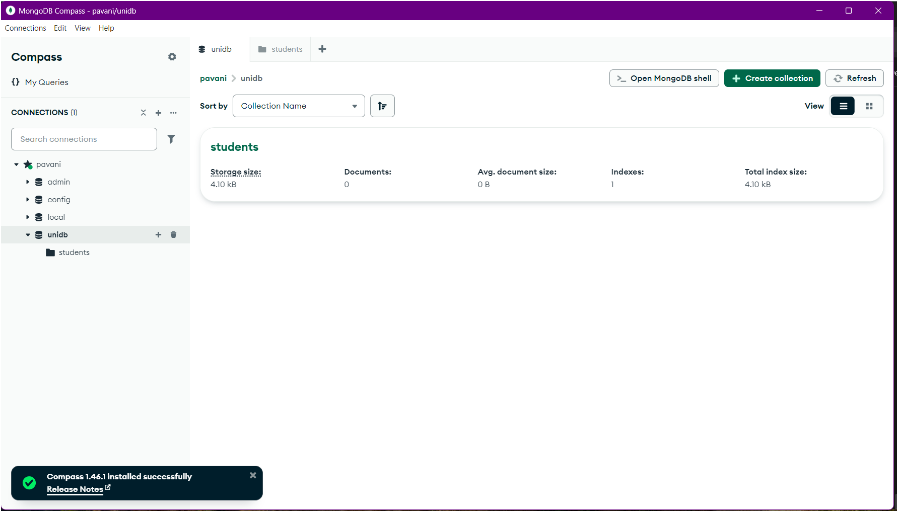

# 🍃 MongoDB Hands-On Project

📦 **DB Creation** ・ 📁 **Collections** ・ 🛠️ **CRUD Operations** ・ 🔍 **Queries**

---

## 🧠 Key MongoDB Concepts

- **📂 Database** → A container for collections (like folders for your data).
- **📁 Collection** → Similar to a table in relational DBs, holds documents.
- **📄 Document** → A JSON/BSON-style object storing the actual data.
- **🆔 `_id`** → Auto-generated unique identifier for each document.

---

## 🏗️ Creating Your First Database & Collection

1. 🚀 Launch **MongoDB Compass**.
2. ➕ Click on **Create Database**.
3. 📝 Enter:
   - **Database Name** → `unidb`
   - **Collection Name** → `students`
4. ✅ Hit **Create Database**.

> 💡 *Congrats!* You've created your first database and collection!

---

## 🔁 CRUD Operations Preview

| Operation | Action                 | Example                         |
|----------:|------------------------|----------------------------------|
| ➕ Create | Insert a student       | `db.students.insertOne({...})`  |
| 🔍 Read   | Find student records   | `db.students.find()`            |
| ✏️ Update | Modify a record        | `db.students.updateOne({...})` |
| ❌ Delete | Remove a document      | `db.students.deleteOne({...})` |

---
